2022-5-25

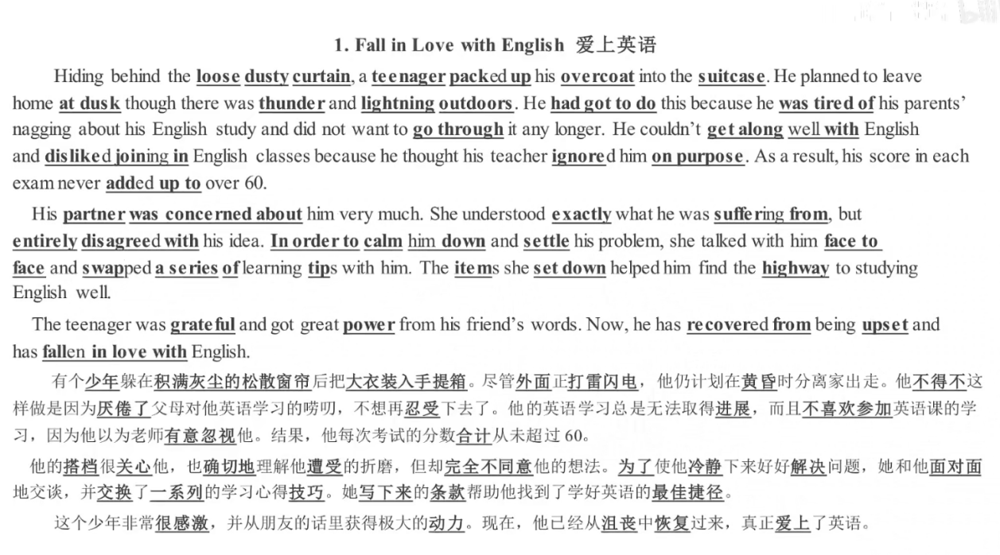

2022-5-26


2022-5-27
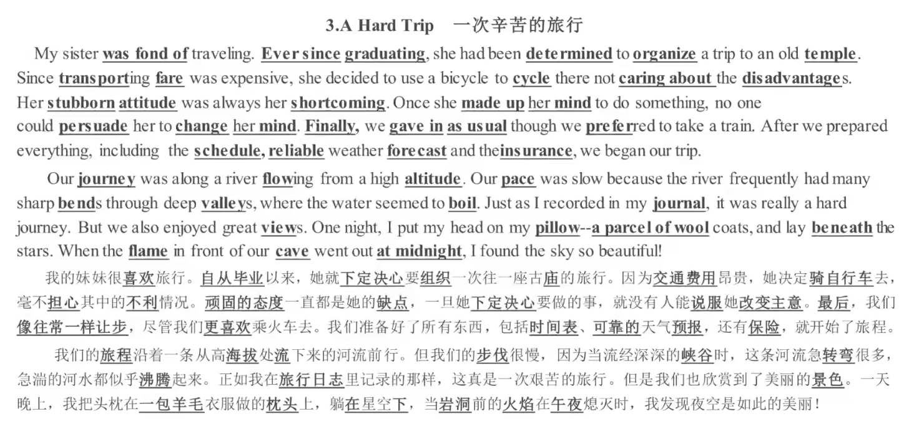

```
pillow 枕头	a parcel of wool 一包羊毛
```

2022-5-28
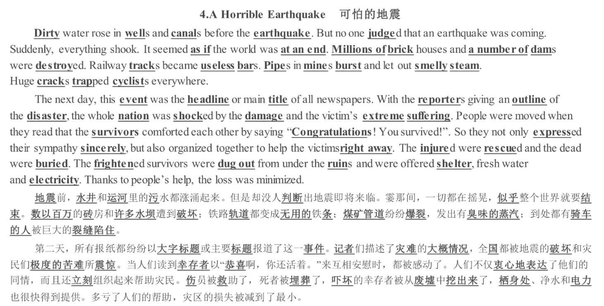


```
wells 水井	cannals 运河	dams 水坝	tracks 轨道	bars 条	mines 煤矿	smelly 臭味的
crack 裂缝	trapped 陷住	outline 大概情况	
```

2022-6-16
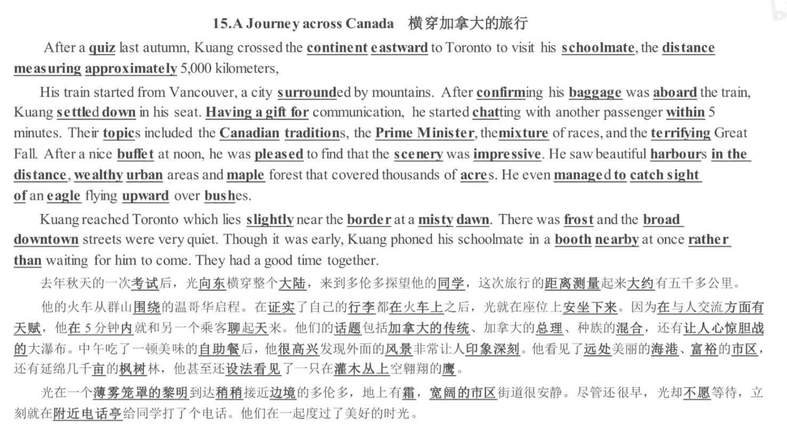
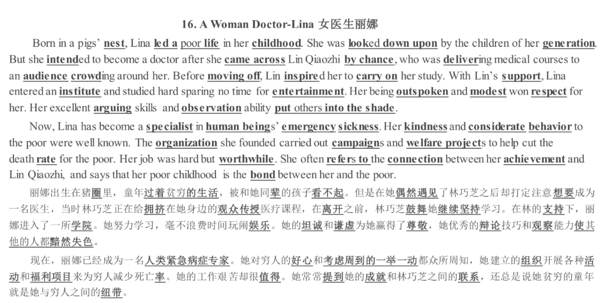

2022-6-16

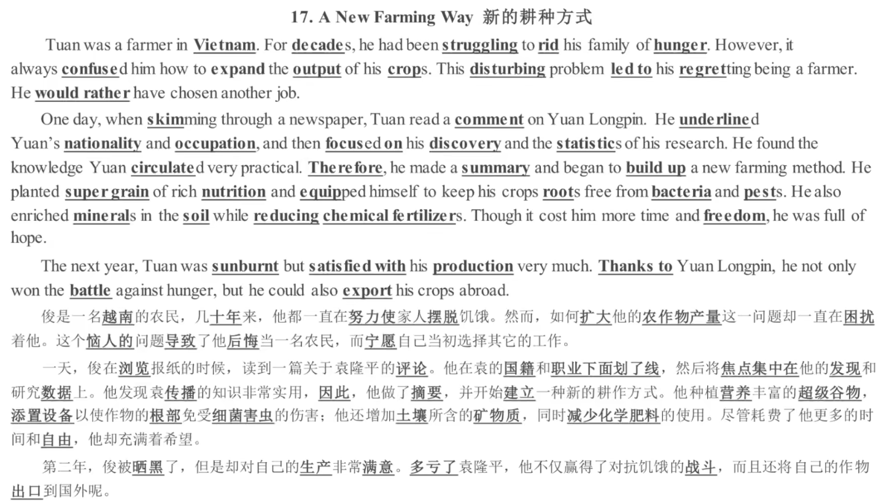

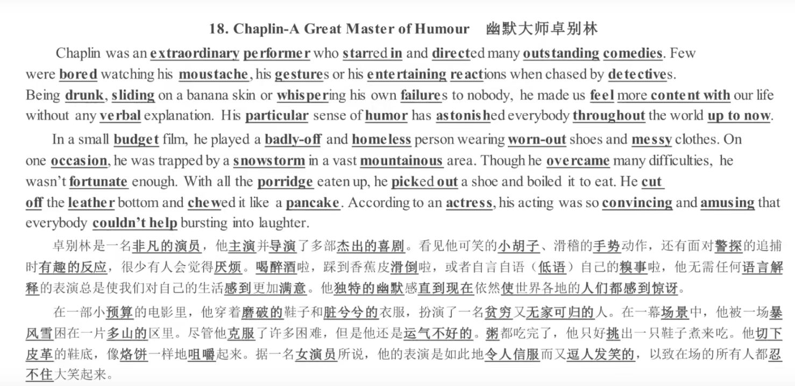

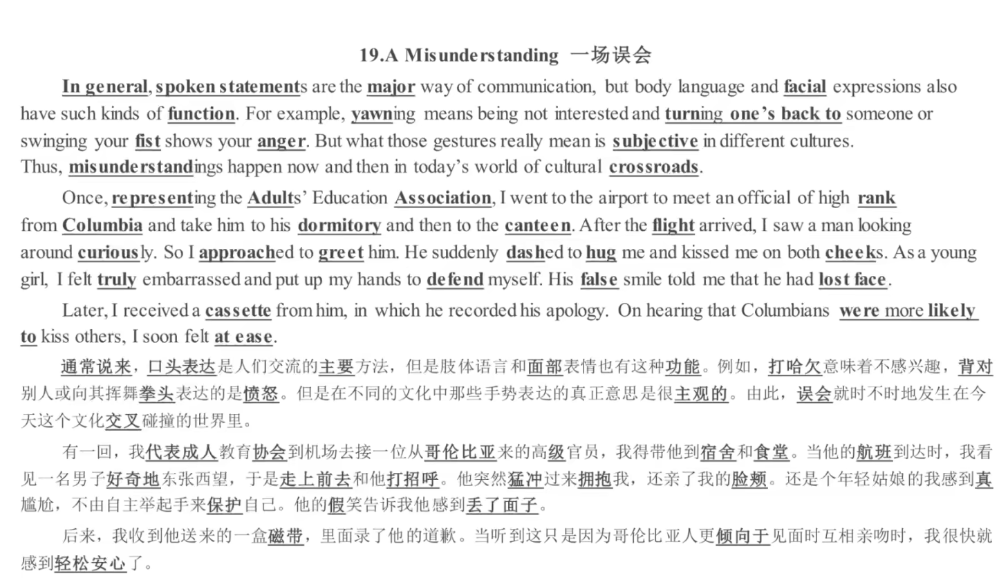

2022 -6-24
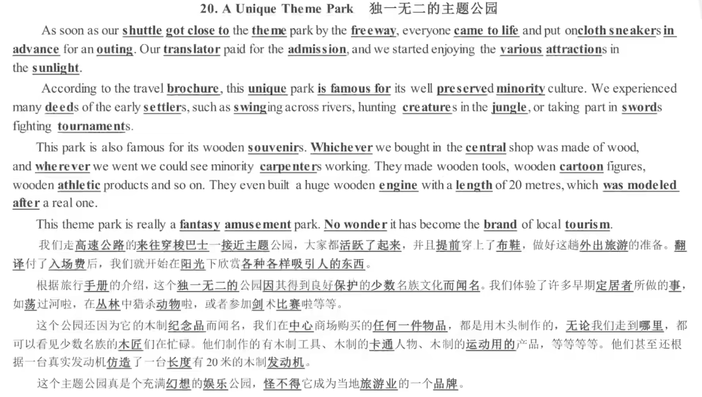

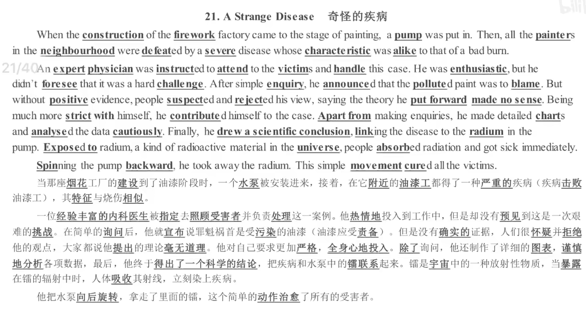

2022-7-6
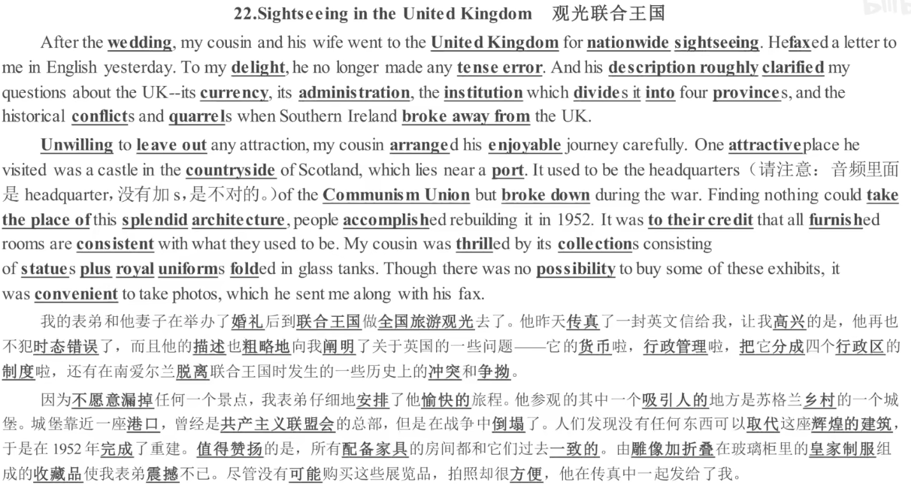

institution 机构 Communism 共产主义  union 联盟,工会  headquarters 总部 administration 行政

furnish 提供,供给，n.装设  glass tank 玻璃柜


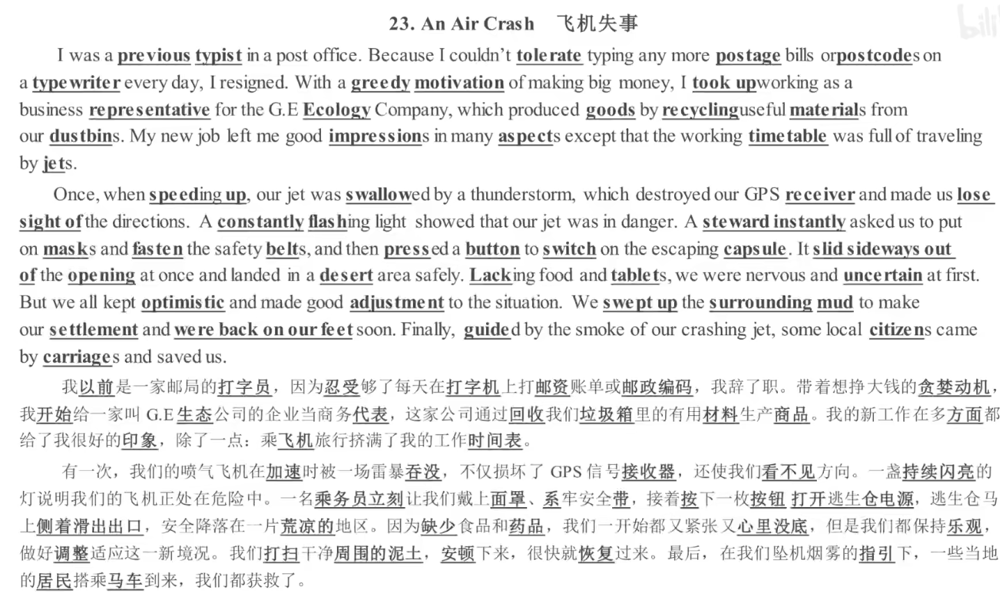


 postage  邮政邮资  postcode 邮政编码 dustbin 垃圾桶 speed up 加速 constantly 不断地 steward 乘务员 

be back on out feet 重新站起来 settlement sideway 侧身 silde away 划开 opening 入口

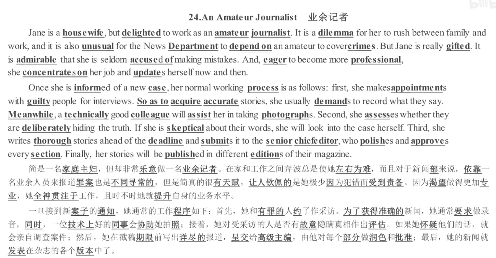


amateur 业余  dilemma 左右为难 unusual 不同寻常 admirable 钦佩的  seldom 很少 

inform 通知 acquire 获得 accurate 准确的 thorough 彻底的，详尽的  edition 版本

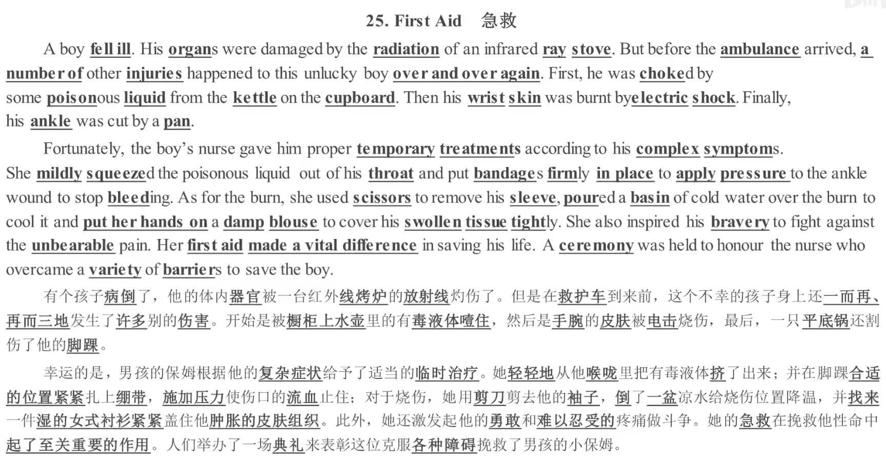


ray stove 射线炉	squeeze 挤压	bandage 绷带 scissors 剪刀	sleeve 袖子	damp潮湿	blouse 女士衬衫	tissure  组织

swollen 肿	unbearable 无法忍受的	barriers 障碍	make a vital difference 起至关重要的作用


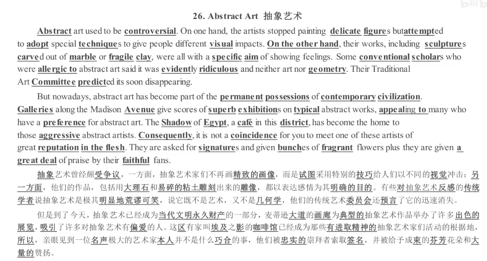

specific 明确的	conventional 传统的	scholars 学者	aggressive 积极的，挑衅的	Consequently 最后	coincidence 巧合	

faith 信仰	faithful 可信的